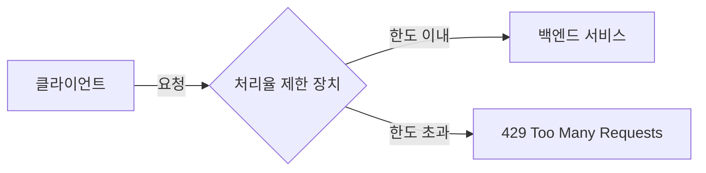
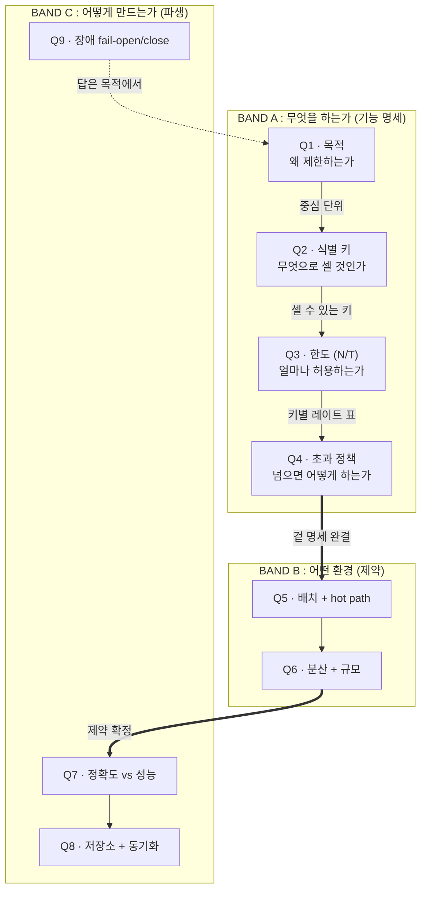
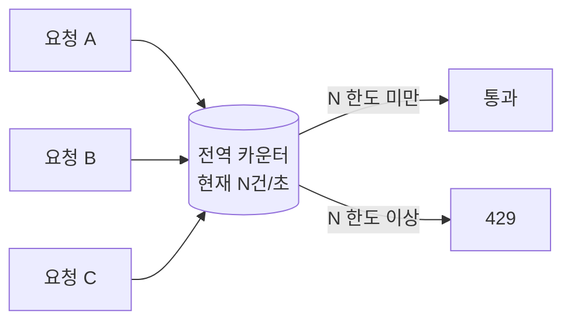
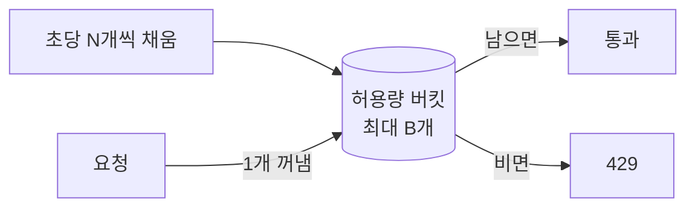
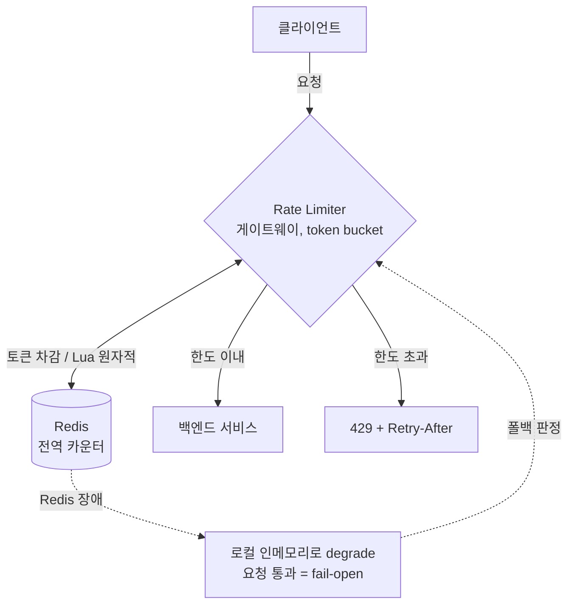

# 처리율 제한 장치 설계

> 4장을 읽었지만  "내가 이 장치를 직접 설계해야 했다면 어떤 순서로 무엇을 물었을까"를 처음부터 사고해본 기록.

## 무엇을 만드나 (개념)

요청이 백엔드에 닿기 전에 한 겹 끼어서, 한도 이내면 통과시키고 초과면 막는 장치. 문제는 "무엇을 기준으로, 얼마나, 어디서, 어떻게" 막느냐인데, 그걸 아무 순서로나 정하면 설계가 흔들린다.

**관통하는 원리:** 각 질문은 "바로 앞 질문의 답"을 입력으로 먹어야만 성립한다. 앞 답이 없으면 던질 수 없는 질문이면 뒤로 간다. 즉 순서는 취향이 아니라 의존성이 강제한다. 이 사슬을 따라가면 질문이 세 밴드로 갈린다.

## 전체 구조

밴드 순서 규칙: A(무엇을) 다음 B(환경/제약) 다음 C(어떻게). C(알고리즘·저장소)를 먼저 고르는 건 솔루션 점프다. 알고리즘은 고르는 게 아니라 A·B에서 떨어지는 것. 단, 사슬이 두 군데서 직선이 아니다. Q9(장애 대응)의 답은 Q1(목적)으로 되돌아오고, Q6(분산)은 명세를 안 바꾸고 C로만 영향을 준다.

---

## Band A : 무엇을 하는가 (기능 명세)

이 밴드가 끝나면 "이 장치가 겉으로 무엇을 하는가"가 단일 노드 기준으로 완결된다. 아직 분산·지연·저장은 등장하지 않는다.

### Q1. [목적] 왜 제한하는가

입력: (시작점)

"무엇을 제한할까"부터 떠올리면 목록이 무한히 늘어난다. 전체 처리량, 특정 API, 특정 사용자, 그 조합까지 끝이 없다. 늘어나는 이유는 목적을 안 정했기 때문. "무엇을"은 그 자체로 정답이 없고, "왜"가 정해져야 거기서 연역된다. 목적이 바뀌면 제한의 중심 단위가 통째로 옮겨간다.

| 목적 | 핵심 관심사 | 중심 단위 |
| --- | --- | --- |
| 백엔드 과부하 방지 | 시스템이 초당 몇 건까지 버티나 | 전체 시스템 처리량 |
| 자원의 공정한 분배 | 한 사용자의 독점 차단 | 사용자별 처리량 |
| 비용·남용 방지 | 무료 자원 과다 호출 차단 | 사용자별 + API 키별 |
| 보안 위협 차단 | 무차별 대입 등 공격 억제 | IP별 + 민감 API별 |

출력: 제한의 중심 단위 (Q2의 입력)

### Q2. [식별 키] 무엇으로 셀 것인가

입력: Q1의 중심 단위

중심 단위가 "사용자별"이라 해도, 서버가 들어온 요청을 보고 "이게 누구냐"를 식별하지 못하면 아직 셀 수 없다. 그 식별 기준이 식별 키다. 키마다 구분 방식과 약점이 다르다.

| 식별 키 | 무엇으로 구분 | 어울리는 목적 | 약점 |
| --- | --- | --- | --- |
| IP 주소 | 출발 네트워크 주소 | 비로그인 트래픽·공격 차단 | 공유망 사용자가 한 IP로 묶여 억울하게 막힘 |
| 사용자 ID | 로그인 계정 | 자원 공정 분배 | 로그인 전 요청엔 못 씀 |
| API 키 | 발급된 키 | 비용·남용 방지 | 키 발급·관리 체계가 선행돼야 함 |
| 전역 | 구분 안 함, 전체를 하나로 | 과부하 방지 | 누가 부하원인지 못 가림 |

키가 정해져야 "이 요청은 누구의 몇 번째인가"를 셀 수 있다. 셀 수 있어야 비교할 수 있고, 비교해야 초과를 판단할 수 있다.

출력: 셀 수 있는 키 (Q3의 입력)

### Q3. [한도 = N건 / T시간창] 얼마나 허용하는가

입력: Q1(목적이 N의 출처를 가름) + Q2(한도는 "키별")

한도는 숫자 하나가 아니다. 여러 속성으로 쪼개진다.

- **크기 N**: 몇 건까지
- **시간창 T**: 초/분/시/일 중 무엇당. ("100건"은 한도가 아니다. "단위시간당 100건"이라야 한도다)
- **버스트 허용**: 평소 100/분인데 순간 20개가 몰리는 걸 봐주나
- **계층/중첩**: 무료 100 vs 유료 1000, 또는 유저별·엔드포인트별·전역 한도를 동시에 적용
- **N의 출처**: 용량 측정값 / 요금제 / 보안 규칙 중 어디서 뽑나 (Q1이 결정)

> 주의: 시간창 경계와 버스트에서 "정확히 100"이 이미 흔들린다. 여기서 새는 게 나중에 Q7(정확도) 논의를 강제한다.

출력: 키·계층별 레이트 표 (Q4와 Q7의 입력)

### Q4. [초과 정책] 넘으면 어떻게 하는가

입력: Q1(보안이면 칼같이 거부, UX 민감하면 완화 고려) + Q3(한도가 있어야 '초과'가 성립)

- **처리 방식**: 즉시 거부(429 드롭) / 스로틀(지연) / 큐잉(버퍼링 후 처리) / 소프트 디그레이드(캐시·축소 응답)
- **통지**: 상태코드 429 + `Retry-After`(언제 재시도) + `X-RateLimit-Remaining/Reset`(성공 응답에도 남은 한도 미리 알림)
- **거부된 요청도 카운트에 포함하나**

트레이드오프: 즉시 거부는 백엔드 보호 최강이지만 UX가 거칠다. 큐잉은 UX가 부드럽지만 새 부하원이자 지연 누적(hot path와 상극). 스로틀은 중간.

출력: API 계약(코드+헤더 스펙) + 초과 트래픽 전략. (큐잉을 고르면 그 큐가 다시 시스템 설계로 번진다)

---

## Band B : 어떤 환경에 사는가 (제약)

> 다음 단계에서 깎을 영역. 명세를 안 바꾸고 품질 제약(지연·메모리·결함감내)의 세기와 "상태 공유 여부"를 정한다.

- **Q5 [배치 + hot path]** 어디 두고, 모든 요청이 동기로 통과하나. 클라이언트 / 게이트웨이 / 앱 미들웨어(Spring 인터셉터·필터) / 독립 서비스. 동기 인라인이면 지연·결함감내가 강제 요구사항으로 승격. 신뢰 경계상 보안 목적은 서버 측 강제. (목적 Q1에 가장 강하게 매이는, 제일 무른 순서 엣지)
- **Q6 [분산 + 규모]** 분산인가, 규모는(QPS·키 카디널리티) 얼마인가. 글로벌 한도면 상태 공유 필수, 동시 증가 때문에 원자성 필요. 명세는 안 바꾸고 C로만 떨어진다.

## Band C : 어떻게 만드는가 (파생, 맨 끝)

> A·B가 정해지면 떨어지는 결정들. 여기부터 먼저 손대면 솔루션 점프.

- **Q7 [정확도 vs 성능]** 한도를 얼마나 엄격히 지키나? 살짝 초과 허용? 이 답이 알고리즘 family를 가른다 (정확한 sliding log / 싼 근사 counter / 흘려보내는 token·leaky bucket).
- **Q8 [저장소 + 분산 카운터 동기화]** 메모리 vs 외부 공유 저장소, 원자적 증가. Q6(분산)·Q7(정확도)에서 떨어진다.
- **Q9 [장애: fail-open / fail-close]** 장치가 죽으면 통과냐 차단이냐? 답은 Q1(목적)에서 나온다. 과부하 방지면 fail-open이 위험, 보안이면 fail-close가 맞을 수 있음.

사슬의 끝(Q9)이 머리(Q1)를 다시 무는 게 핵심. "목적부터 박아라"가 왜 0번인지의 증거다.

---

## 설계 결정 (최종)

> 목적이 "과부하 방지 / 전역"이라 나머지가 거의 일직선으로 떨어짐. 디폴트대로 확정.

### 결정 로그

| # | 항목 | 결정 |
| --- | --- | --- |
| Q1 | 목적 | 백엔드 과부하 방지 (중심 단위: 전역 스루풋) |
| Q2 | 식별 키 | 없음. 전체를 카운터 하나로 |
| Q3 | 한도 | 초당 N건 (가정 N=800/s) + 작은 버스트 |
| Q4 | 초과 정책 | 즉시 429 + Retry-After |
| Q5 | 배치 | API 게이트웨이, 동기 hot path, 서버측 |
| Q6 | 분산 | 분산. 전역 한도라 카운터 노드 간 공유 |
| Q7 | 알고리즘 | token bucket |
| Q8 | 저장소 | Redis + Lua 원자적 갱신 (Java: Bucket4j) |
| Q9 | 장애 | fail-open + 로컬 폴백 |

### 항목별 근거

**Q1·Q2 무엇을, 어떻게 세나**

- 목적은 백엔드 과부하 방지. 시스템 전체 용량 지키는 게 1순위
- 전역이라 "누구 요청인지" 안 따짐. 식별 키 없이 전체를 카운터 하나로
- 대가: 한 클라가 전역 한도 다 먹고 남들 굶길 수 있음. 근데 그건 '공정 분배'(다른 목적)라 지금은 범위 밖

**Q3 한도**

- 시간창은 초당. 분당이면 한도 남아도 첫 몇 초 폭주에 백엔드 먼저 터짐. 과부하는 평균이 아니라 순간 피크 문제
- N은 설계가 정하는 값 아님. 부하 테스트나 스펙에서 오는 입력. 마진 두고 잡고 문서엔 파라미터로 (가정 800/s)
- 버스트는 작게 허용. 평소 조용하다 가끔 튀는 정상 스파이크 흡수용. 여유(헤드룸) 없으면 빡빡으로

**Q4 초과 정책**

- 즉시 거부(429). 과부하엔 부하를 빨리 떨궈야 함
- 큐잉은 탈락. 지연 쌓이고 큐 자체가 새 부하원. hot path에 큐는 독
- 통지는 429 + `Retry-After` 헤더. 평소엔 `X-RateLimit-Remaining/Reset`로 남은 한도 미리 줌
- 거부된 요청은 카운터에 안 셈

**Q5 배치**

- API 게이트웨이. Spring이면 서비스 앞단 인터셉터/필터도 가능
- 동기 hot path. 모든 요청이 판정 기다림. 그래서 지연·결함감내가 빡센 요구사항이 됨
- 클라측은 우회 가능해서 탈락. 과부하 보호는 서버측 강제

**Q6 분산**

- 분산 환경, 노드 여러 대
- 전역 한도 = 노드 합쳐서 N. 카운터를 노드 간 공유해야 함
- 노드별로 N/M 쪼개는 방식은 트래픽 쏠리면 부정확. 공유 카운터로 감

**Q7 알고리즘**

- token bucket. 위에서 그린 'rate + 버스트' 그 모델 그대로
- 메모리 O(1) (키당 토큰 수랑 마지막 갱신 시각만 들고 있음), 빠름
- 버킷 용량 B만 만지면 빡빡이든 여유든 다 됨
- 대안은 sliding window counter. 경계 더 매끈한 대신 약간 무거움

**Q8 저장소**

- Redis. 노드 공유 카운터를 인메모리로는 못 함
- 동시 증가 race는 Lua 스크립트로 원자적 처리 (읽기 + 차감 + 쓰기를 한 방에)
- Java면 Bucket4j + Redis 백엔드로 거의 바로 붙음

**Q9 장애**

- fail-open + 로컬 폴백
- Redis 죽어도 요청 막지 않음. rate limiter가 서비스를 죽이면 안 됨
- 순수 fail-open은 보호가 통째로 빠짐. 그래서 노드별 인메모리 로컬 한도로 degrade해서 최소한은 막음
- fail-close는 API 전체 다운이라 탈락
- 이 선택의 근거가 Q1(과부하 방지). 보안 목적이었으면 fail-close가 맞았을 수도

### 최종 아키텍처

- 평상시: 게이트웨이의 token bucket이 Redis 전역 카운터에서 토큰 차감(Lua 원자적). 남으면 통과, 없으면 429
- 장애 시: Redis 빠지면 노드별 로컬 한도로 degrade. 보호는 약해져도 서비스는 안 죽음