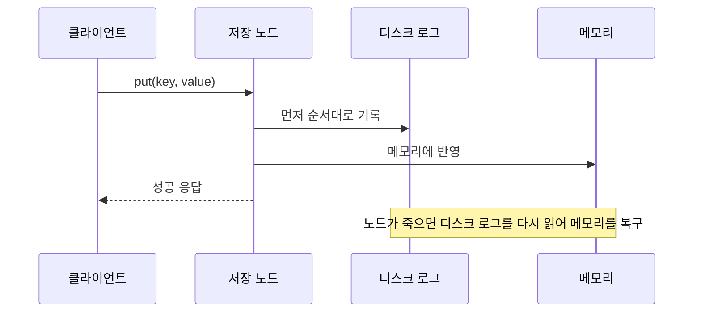
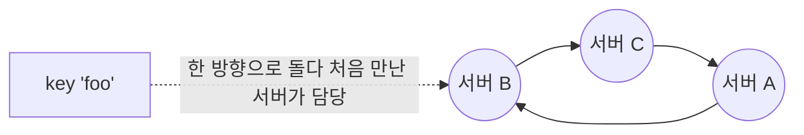
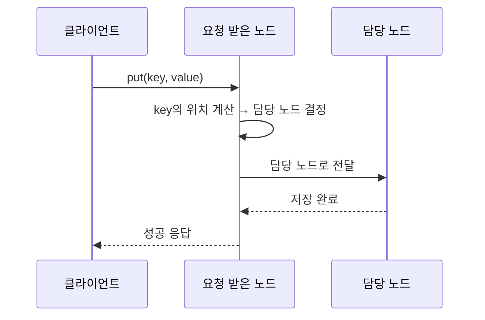
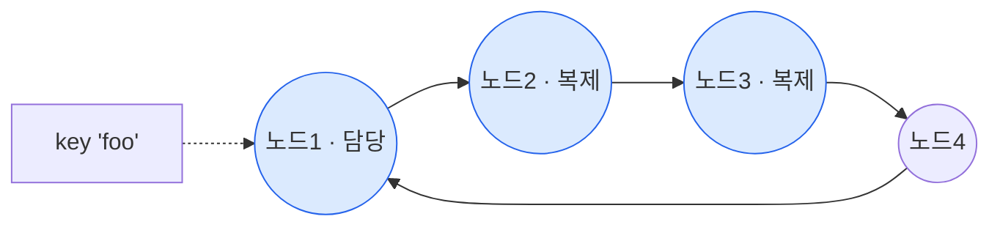
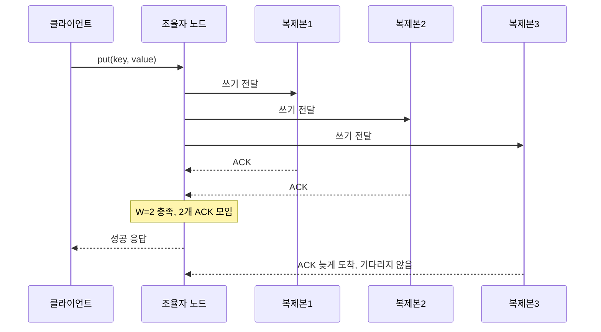
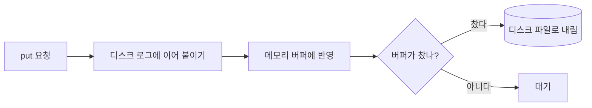
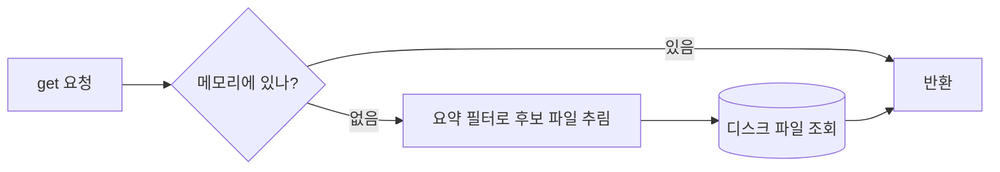

# [Ch.06] 키-값 저장소 설계 — 1주차 1차 설계안

> 작성자: 최호석 (ghtjr410)
> 작성 기준: **책 6장 해설을 보기 전**, 문제와 요구사항만 보고 직접 설계한 1차 안
> 스터디: 『가상 면접 사례로 배우는 대규모 시스템 설계 기초』 (Alex Xu)

1주차 산출물이다. 책에 나오는 정답 용어를 미리 가져다 쓰지 않고, 요구에서 출발해 필요한 구조를 하나씩 추론한다. 확신이 안 서는 부분은 2주차에 책과 비교할 지점으로 남긴다.

## 설계하면서 떠오른 질문들

설계는 이 질문들을 위에서부터 하나씩 답해가는 순서로 진행한다. 위쪽이 큰 결정이고, 아래로 갈수록 그 결정에 딸려 나오는 세부다.

- 무엇을 위한 저장소인가. 어떤 기능·비기능·규모 요구를 만족해야 하나.
- 이 데이터를 관계형으로 다룰까, 비관계형으로 다룰까. 왜 키-값인가.
- 값을 어디에 둘까. 메모리냐, 디스크냐, 둘을 섞느냐.
- 한 대로 감당되나, 여러 대로 나눠야 하나.
- 여러 대라면 어떤 키를 어느 서버에 둘까.
- 서버 하나가 죽으면 데이터가 같이 사라지나. 몇 개로 복제할까.
- 복제본끼리 값이 다르면 무엇을 정답으로 볼까. 일관성을 어디까지 보장할까.
- 같은 키에 동시에 쓰면 누구 값이 이기나. 충돌을 어떻게 푸나.
- 노드가 죽은 걸 누가 어떻게 감지하나.
- 잠깐 죽은 것과 영영 죽은 것을 어떻게 다르게 복구하나.
- 읽기와 쓰기가 노드 안에서 어떤 경로로 흐르나.
- 결국 일관성과 가용성 중 무엇을 우선할까.

## 0. 요구사항

설계에 들어가기 전에 요구사항을 못박는다. 아래 모든 결정은 여기서 끌어온다. 요구가 정해지지 않은 결정은 취향 싸움일 뿐이다.

### 기능 요구

- `get(key)`: 키로 값 조회
- `put(key, value)`: 저장과 갱신
- `delete(key)`: 삭제
- 범위 조회나 키 사이 조인은 하지 않는다. 키-값 모델의 전제다.

### 비기능 요구

- 내구성: 받았다고 응답한 데이터는 잃지 않는다. 영속 저장소다.
- 가용성: 일부 노드가 죽거나 끊겨도 서비스는 응답한다.
- 낮은 지연: 읽기와 쓰기가 빠르다.

### 규모 가정

숫자는 정확한 값이 아니라 합의된 가정이다. 결정의 기준점으로 쓴다.

- 데이터 총량: 수백 TB ~ PB. 한 대로는 불가능한 규모.
- 키/값 크기: 값 하나가 수 KB 미만.
- 읽기:쓰기 = 약 9:1. 읽기가 지배적.
- 초당 읽기 수만 건 수준.

### 핵심 갈림길: 일관성과 가용성

네트워크가 끊겨 일부 노드와 연락이 안 될 때 둘 중 하나만 가능하다. 가용성을 택했다.

| 후보 | 결정 | 근거 |
|---|---|---|
| **가용성 우선** | **채택** | 끊겨도 응답을 멈추지 않는다. 잠깐 옛 값이 보일 수 있지만 읽기 지배적인 대규모 서비스엔 이게 맞다. |
| 일관성 우선 | 탈락 | 최신값을 보장 못 하면 에러를 낸다. 잔액·재고처럼 정확성이 생명일 때 쓰는 선택. 우리 요구와 안 맞는다. |

### 이 요구가 이미 확정한 것

요구를 박는 순간 뒤 섹션 일부가 자동으로 정해진다.

- 영속 + 수백 TB~PB → 데이터 본체는 디스크. 메모리 우선 방식은 탈락. (→ 2번)
- 수백 TB~PB → 한 대로는 불가능, 여러 대 분산 강제. (→ 3번)
- 읽기 9:1 → 복제와 캐시는 읽기를 빠르게 하는 쪽으로 기운다. (→ 5번 이후)

## 1. 관계형이 아니라 키-값인 이유

키-값 저장소를 골랐다는 건 관계형을 버렸다는 뜻이다. 버린 이유는 풀려는 문제가 관계형을 필요로 하지 않아서다.

순서가 거꾸로다. 비관계형을 택한 게 먼저가 아니라 요구가 먼저다. 데이터는 한 대에 다 안 들어갈 만큼 크고, 서버 몇 대가 죽어도 서비스는 돌아야 하고, 트래픽이 늘면 서버를 붙여 감당해야 하고, 응답은 빨라야 한다. 이 넷을 동시에 만족시키려고 내려가다 보면 데이터 모델이 키-값까지 줄어든다.

관계형으로는 이 넷을 주기 어렵다. 관계형의 무기는 조인, 외래키, 트랜잭션, 고정 스키마, 강한 일관성이고, 이 무기는 전부 데이터가 한곳에 모여 서로를 참조한다는 전제 위에 선다. 데이터를 여러 대로 쪼개는 순간 조인과 트랜잭션은 서버 경계를 넘나들어야 하고, 그건 느리고 복잡하다. 관계형의 강점이 수평 확장과 부딪힌다.

키-값은 데이터 모델을 줄여 이 충돌을 피한다. 접근을 키로 값 하나 읽고 쓰기로 제한하면, 레코드가 서로 독립이라 키 기준으로 아무 서버에나 흩어놔도 된다. 조인이 없으니 노드끼리 맞출 일이 없고 서버를 붙이기 쉽다. 원하던 대용량·고가용·수평 확장·낮은 지연이 이 단순함에서 나온다.

대신 조인, 범위 검색, 여러 키를 묶는 트랜잭션, 강한 일관성의 일부를 포기한다. 손해가 아니라 교환이다. 이 문제엔 그게 필요 없었다. 주문과 사용자를 조인해 보여주는 게 핵심 요구였다면 키-값을 고르지 않았다.

## 2. 값을 어디에 둘까: 메모리냐 디스크냐

메모리와 디스크를 섞어 쓴다. 한쪽만 고르면 앞에서 원한 요구 중 하나가 깨지기 때문이다.

저장 매체에서 부딪히는 두 요구는 낮은 지연과 대용량이다.

메모리에 두면 읽고 쓰기가 빠르다. 대신 한 대에 담을 양이 적고, 전원이 나가거나 프로세스가 죽으면 내용이 사라진다. 빠르지만 작고 잘 잃는다.

디스크에 두면 용량이 크고 전원이 나가도 남는다. 대신 매번 디스크를 때리면 느리다. 안전하고 크지만 느리다.

그래서 한쪽만으로는 네 요구를 다 못 지킨다. 자주 찾는 데이터는 메모리에 얹어 빠르게 응답하고, 전체는 디스크에 남겨 용량과 보존을 챙기는 식으로 둘을 같이 쓴다.

여기서 문제가 하나 따라온다. 메모리에 있던 내용은 노드가 죽으면 사라진다. 그러면 방금 받아서 성공이라고 답한 쓰기도 같이 날아갈 수 있다. 받았다고 해놓고 잃으면 안 된다. 그래서 쓰기를 받으면 메모리에 반영하기 전에 디스크에 먼저 순서대로 적어두는 게 필요해 보인다. 노드가 죽었다 살아나면 그 기록을 다시 읽어 복구하면 된다. 이 방식에 정해진 이름이 있는지는 2주차에 확인한다.

쓰기 한 건이 흐르는 모습은 이렇게 그려진다.



## 3. 한 대로 되나, 여러 대로 나눠야 하나

여러 대로 나눈다. 한 대로는 앞에서 정한 대용량과 고가용을 원천적으로 못 지킨다.

한 대 안에서 메모리와 디스크를 아무리 잘 섞어도 디스크 용량엔 끝이 있다. 데이터가 그 끝을 넘으면 더 담을 곳이 없다. 대용량 요구가 한 대의 물리 한계에 막힌다.

게다가 그 한 대가 죽으면 전체가 멈춘다. 서버가 죽어도 서비스는 돌아야 한다는 요구와 정면으로 어긋난다. 한 대짜리 구성은 그 자체가 유일한 약점이다.

트래픽도 같다. 한 대가 처리할 수 있는 요청 수엔 한계가 있고, 늘면 못 버틴다.

그래서 여러 대로 간다. 여러 대로 가면 서로 다른 두 가지 일이 생긴다. 하나는 데이터를 쪼개 나눠 담는 일이고 이건 용량을 위해서다. 다른 하나는 같은 데이터를 여러 대에 복제하는 일이고 이건 죽어도 살아남기 위해서다. 목적이 다르니 따로 본다. 먼저 나눠 담기다.

## 4. 어떤 키를 어느 서버에 둘까

키마다 담당 서버를 정하는 규칙이 필요하다. 그 규칙은 두 가지를 만족해야 한다. 키가 서버에 고르게 흩어질 것, 그리고 서버를 더하거나 뺄 때 이미 자리잡은 키가 최대한 안 움직일 것.

규칙이 필요한 이유부터. 데이터를 여러 대에 나눠 담는 순간, 쓸 때는 이 키를 어느 서버에 둘지, 읽을 때는 어느 서버에서 찾을지를 매번 정해야 한다. 둘은 같은 답을 내야 한다. 같은 키가 늘 같은 서버로 가야 넣은 걸 다시 찾는다. 결국 키를 넣으면 담당 서버를 돌려주는 함수 하나를 정하는 문제고, 모든 노드가 이 함수를 똑같이 공유한다.

가장 단순한 시도. 서버에 0번부터 번호를 매기고, 키를 숫자로 바꿔 서버 수로 나눈 나머지를 담당 번호로 쓴다. 키가 고르게 흩어지는 건 이걸로 된다.

문제는 서버 수가 바뀔 때다. 서버를 한 대 더하거나 빼면 나누는 수가 달라지고, 나머지 값이 거의 모든 키에서 바뀐다. 곧 데이터 대부분이 담당 서버를 옮겨야 한다. 옮기는 동안 키를 못 찾고 서비스가 출렁인다. 두 번째 조건을 정면으로 어긴다.

그래서 서버 수가 바뀌어도 대부분의 키는 담당이 그대로인 규칙이 필요하다. 단순한 나머지 계산은 서버 수를 규칙 한가운데 넣어버려서, 서버가 바뀌면 전부 흔들렸다. 그러면 서버 수를 규칙의 중심에서 빼면 된다.

이렇게 해볼 수 있다. 키와 서버를 같은 원형 번호판 위에 올린다. 키도 한 점, 서버도 한 점이다. 키는 자기 위치에서 한 방향으로 돌다 처음 만나는 서버가 맡는다. 이러면 서버 하나가 빠질 때 그 서버가 맡던 구간만 옆 서버로 넘어가고 나머지는 그대로다. 서버를 더하면 그 점 근처 구간만 새로 나뉜다. 서버 수가 아니라 위치가 담당을 정하니, 한 대 변동이 전체가 아니라 인접 구간에만 닿는다. 이 방식에 정해진 이름이 있는지는 2주차에 확인한다.



요청이 들어와 담당 서버를 찾아가는 흐름은 이렇다.



## 5. 같은 데이터를 몇 개로, 어디에 복제할까

원본 포함 3개를, 서로 다른 물리 서버에 둔다.

복제 자체는 0번 요구가 강제한다. 노드가 죽어도 응답해야 하고(가용성) 받은 데이터는 잃으면 안 되니(내구성), 데이터가 한 곳에만 있으면 그 노드가 죽는 순간 둘 다 깨진다. 그래서 같은 데이터를 여러 노드에 둔다. 남는 질문은 몇 개냐다.

| 후보 | 결정 | 근거 |
|---|---|---|
| 1개 (복제 없음) | 탈락 | 노드가 죽으면 데이터 소실에 응답 불가. 요구 정면 위반. |
| 2개 | 탈락 | 1대 죽어도 1개는 남지만, 뒤에서 정할 다수결 합의를 세울 여유가 없다. 복구 중 또 1대 죽으면 소실. |
| **3개** | **채택** | 1대 죽어도 2개가 남아 다수결이 선다. 내구성과 비용의 균형점. |
| 5개 이상 | 탈락 | 더 안전하지만 쓰기·저장 비용이 커진다. 읽기 분산엔 이득이나 지금 규모엔 과하다. |

어디에 둘지는 4번의 원형 배치를 그대로 쓴다. 키 담당 노드부터 한 방향으로 돌며 다음 노드 2개를 복제본으로 잡는다.

- 함정 하나. 4번에서 한 물리 서버를 원 위 여러 점으로 흩뿌렸다. 그래서 "다음 점 2개"가 우연히 같은 물리 서버일 수 있다. 그러면 그 기계 한 대가 죽을 때 복제본이 같이 죽는다.
- 그래서 다음 점이 이미 고른 것과 같은 물리 서버면 건너뛰고, 서로 다른 기계 3대가 되도록 잡는다.



## 6. 복제본 사이 일관성: 합의 방향

모든 복제본의 응답을 다 기다리지 않는다. 정해둔 개수만 성공하면 완료로 친다.

이것도 0번이 끌고 온다. 가용성을 우선했으니, 쓰기가 모든 복제본의 응답을 다 기다리면 그중 한 대만 느리거나 죽어도 전체가 막힌다. 가용성 위반이다. 그래서 일부만 기다린다. 대신 "일부만"이 헐거우면 방금 쓴 값을 다음 읽기가 못 본다. 이 사이를 어디서 끊느냐가 합의의 방향이다.

복제 수를 N, 쓰기 성공 기준을 W, 읽기 성공 기준을 R이라 하자.

| 후보 | 결정 | 근거 |
|---|---|---|
| W=N, R=1 (쓰기는 전부) | 탈락 | 강한 일관성에 가깝지만 1대만 죽어도 쓰기가 막힌다. 가용성 약함. |
| W=1, R=1 (둘 다 하나만) | 탈락 | 가장 빠르고 잘 죽어도 되지만, 방금 쓴 걸 다른 복제본에서 못 읽는다. 옛 값이 보인다. |
| **W=2, R=2 (N=3, 과반)** | **채택** | W+R > N이라 읽기 집합과 쓰기 집합이 반드시 한 노드에서 겹친다. 그 노드가 최신값을 들고 있다. 1대 죽어도 2/2 충족. |

- 핵심 규칙은 `W + R > N`이다. 성립하면 읽을 때 고른 노드들 중 적어도 하나는 마지막 쓰기를 받은 노드라, 최신값을 만난다.
- N=3 기준 W=2, R=2. 한 대가 죽어도 남은 2대로 양쪽을 채운다.
- 쓰기를 더 빨리 받고 싶으면 W=1로 더 느슨하게 갈 수도 있다. 그만큼 옛 값을 읽을 위험이 커진다. 손잡이 하나로 가용성과 정합성을 조절하는 셈이다.
- 이 다수결 합의에 정해진 이름이 있는지는 2주차에 확인한다.



## 7. 같은 키에 동시에 쓰면: 충돌 해소

충돌을 막지 않고, 일단 받은 뒤 나중에 푼다.

6번에서 쓰기를 느슨하게 받기로 한 순간 따라오는 대가다. 두 클라이언트가 거의 동시에 서로 다른 복제본에 같은 키를 쓰면 어느 게 최신인지 모호해진다. 가용성을 우선했으니 한쪽을 거부하지 않고 둘 다 받는다. 그러면 충돌을 감지하고 푸는 장치가 필요하다.

| 후보 | 결정 | 근거 |
|---|---|---|
| 시계 최신값 우선 | 탈락 | 단순하지만 노드 시계가 어긋나면 틀린 값을 최신이라 믿는다. 동시 쓰기 하나를 조용히 버린다. |
| **인과관계 추적** | **채택** | 어떤 쓰기가 어떤 쓰기 다음에 일어났는지 표시를 달아 추적한다. 한쪽이 다른 쪽 뒤면 자동 정리, 진짜 동시면 둘 다 보존해 읽을 때 합치거나 클라이언트에 맡긴다. |

- 방향은 "버리지 말고 추적". 진짜 충돌만 가려 데이터 손실을 막는다.
- 추적 표시를 다는 방식과 그 이름은 2주차에 확인한다.

## 8. 노드가 죽은 걸 어떻게 아나: 장애 감지

중앙 감시자를 두지 않고, 노드끼리 서로의 생사를 주고받아 소문처럼 퍼뜨린다.

분산이라 감지도 분산이어야 한다. 감시자를 한 곳에 두면 그게 단일 장애점이고, 노드가 늘수록 병목이 된다. 0번의 가용성·확장 요구와 어긋난다.

| 후보 | 결정 | 근거 |
|---|---|---|
| 중앙 감시자 | 탈락 | 단순하지만 감시자가 죽으면 감지가 멈춘다. 규모도 한계. |
| 모두가 모두를 직접 확인 | 탈락 | 정확하지만 노드 수의 제곱으로 통신이 폭발한다. |
| **소문 퍼뜨리기** | **채택** | 각 노드가 일부 이웃과 주기적으로 상태를 교환하고 들은 걸 다시 옮긴다. 생사 정보가 번지듯 퍼져 곧 모두가 안다. 통신량이 완만하고 잘 확장된다. |

- 소문 방식의 정식 명칭은 2주차에 확인한다.

## 9. 잠깐 죽음과 영영 죽음: 복구

둘을 다르게 다룬다. 잠깐 죽은 건 임시로 대신 받아두고, 영영 죽은 건 복제본끼리 비교해 채운다.

내구성과 가용성을 같이 지키려면 노드가 빠진 동안에도 쓰기를 받고 나중에 빈 곳을 메워야 한다.

- 일시 장애: 담당 노드가 잠깐 응답을 못 하면 다른 노드가 그 몫을 임시로 받아둔다. 담당이 살아나면 받아둔 걸 넘겨준다. 쓰기를 멈추지 않으면서 데이터를 안 잃는다.
- 영구 장애: 디스크가 깨져 한 복제본이 통째로 사라지면, 같은 데이터를 가진 다른 복제본과 비교해 빠진 부분만 채운다. 전체를 일일이 대조하면 비싸니, 데이터를 요약한 표시를 단계별로 비교해 다른 구간만 빠르게 좁힌다.

| 상황 | 방향 | 비고 |
|---|---|---|
| 일시 장애 | 다른 노드가 임시 대리 수신 후 반납 | 쓰기 무중단 |
| 영구 장애 | 복제본 간 요약 비교로 다른 구간만 동기화 | 전체 대조 회피 |

- 임시 대리 수신과 요약 비교 방식의 정식 이름은 2주차에 확인한다.

## 10. 노드 안에서 읽기와 쓰기는 어떻게 흐르나

2번에서 본체를 디스크로 정했으니, 노드 하나 안에서도 디스크가 본체고 메모리는 버퍼다. 쓰기는 순서대로 빠르게 쌓고, 읽기는 메모리부터 보고 없으면 디스크로 내려간다.

쓰기 경로:



- 받은 쓰기를 디스크 로그에 먼저 이어 붙인다. 죽어도 이 로그로 복구한다.
- 그다음 메모리 버퍼에 반영해 빠르게 응답한다.
- 버퍼가 차면 통째로 디스크 파일로 내린다. 전부 순차 쓰기라 빠르다.

읽기 경로:



- 메모리 버퍼에 있으면 바로 준다.
- 없으면 디스크 파일을 본다. 파일이 쌓이면 느려지니, "이 파일엔 그 키가 없다"를 빨리 걸러내는 요약 필터로 볼 파일을 줄인다.
- 요약 필터와 디스크 파일 구조의 이름은 2주차에 확인한다.

## 11. 전체 아키텍처와 트레이드오프

모든 노드가 같은 역할을 한다. 마스터가 따로 없고, 요청을 받은 노드가 그 요청의 조율자가 된다. 조율자는 키로 담당·복제 노드를 정하고, 정족수만큼 응답을 모아 클라이언트에 답한다. 노드들은 소문으로 서로의 생사를 안다.

```mermaid
flowchart TD
    C[클라이언트] --> Co["요청 받은 노드 = 조율자"]
    Co --> R1[(복제본1)]
    Co --> R2[(복제본2)]
    Co --> R3[(복제본3)]
    R1 -. 소문으로 생사 확인 .- R2
    R2 -. .- R3
    R3 -. .- R1
```

무엇을 얻고 무엇을 포기했는지 종합하면 이렇다.

| 얻은 것 | 대가로 포기한 것 |
|---|---|
| 대용량·수평 확장 — 키 기준 분산 | 범위 조회·키 간 조인 |
| 노드가 죽어도 응답 — 복제 + 정족수 + 가용성 우선 | 항상 최신값 보장, 잠깐 옛 값이 보일 수 있음 |
| 쓰기 무중단 — 느슨한 쓰기 + 임시 대리 수신 | 동시 쓰기 충돌을 따로 해소해야 함 |
| 탈중앙 — 단일 장애점 없음 | 감지·합의가 더 복잡함 |

### 2주차에 책과 대볼 열린 질문

- 키 분배(4번) 원형 배치의 정식 이름과 정확한 동작
- 다수결 합의(6번)의 정식 명칭과 W·R 조정 한계
- 동시 쓰기 충돌(7번) 추적 방식의 구체적 메커니즘
- 장애 감지(8번)·복구(9번)의 정식 기법과 비용
- 노드 내부 저장 구조(10번)의 요약 필터와 파일 구조 이름
- 내가 통째로 빠뜨린 요구나 컴포넌트가 있는지
