# [Ch.06] 키-값 저장소 설계: 2주차 보완 설계안

> 작성자: 최호석 (ghtjr410)
> 작성 기준: 책 6장 해설을 읽고 [1주차 1차 설계안](./week1.md)과 대조해 보완한 2차 안
> 스터디: 『가상 면접 사례로 배우는 대규모 시스템 설계 기초』 (Alex Xu)

## 0. 들어가며

1주차 설계엔 일부러 비워둔 자리가 있다.

- 요구에서 출발해 구조는 추론했지만, 정식 이름은 가져다 쓰지 않았다.
- "정해진 이름이 있는지는 2주차에 확인한다"를 여섯 번 남겼다.
  - 키 분배의 원형 배치, 다수결 합의, 충돌 추적, 소문 퍼뜨리기, 장애 복구, 노드 내부 저장 구조.

2주차는 그 빈칸을 책과 맞춰보는 작업이다.

- 여섯 빈칸은 책의 기법과 대체로 닿아 있었던 듯하다.
- 이름을 몰랐을 뿐 필요는 얼추 짚었다고 본다.
- 그래서 이 글은 설계를 갈아엎기보다, 도출한 구조에 이름을 붙이고 비어 있던 한 겹을 메우는 데 가깝다.

이 글은 1주차를 AS-IS, 책으로 보완한 쪽을 TO-BE로 두고 그림으로 대조한다.

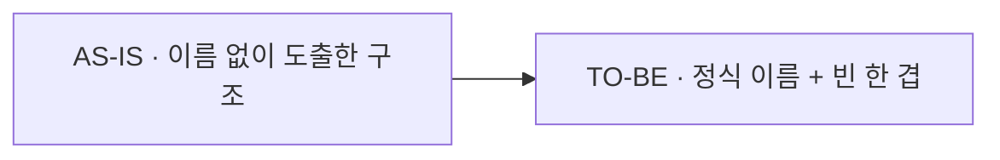

## 1. 1차 설계에서 부족했던 점

### 방향은 비슷하게 잡은 것

세 군데는 동작 원리까지 책과 가까웠던 것 같다.

- 키 분배: 키와 서버를 같은 원형에 올려 시계 방향 첫 서버가 담당하게 한 방식이 책의 안정 해시·해시 링과 닮았다.
- 정족수: `W+R>N`이면 읽기·쓰기 집합이 한 노드에서 겹친다고 본 점이 책의 정족수 합의와 비슷하다.
  - 책이 권장한 기본값(N=3, W=R=2)도 1주차에 고른 값과 같았다.
- 복제: 복제본 3개를 다른 물리 서버에 두되 가상 노드 탓에 같은 기계가 중복될 수 있어 건너뛴다고 본 점이 책의 함정 지적과 겹친다.

키가 링을 돌다 처음 만난 서버가 담당하고, 거기서부터 다음 두 노드가 복제본이 된다.

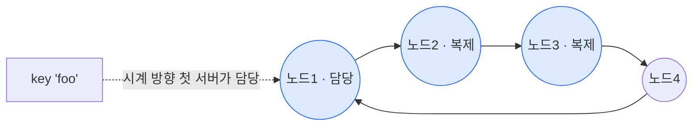

### 방향은 맞지만 한 겹 비어 있던 것

방향은 잡았는데 그 아래 디테일이 비었고, 책이 그 자리를 채워줬다.

- 가상 노드를 왜 쓰나:
  - 1주차는 한 물리 서버를 원 위 여러 점으로 흩뿌린다고만 했다.
  - 책은 두 이유를 댄다. 키를 고르게 분산하려고, 그리고 서버 용량 차이를 가상 노드 수로 맞추려고(다양성).

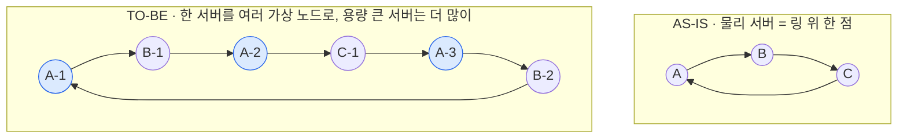

- 충돌 표시가 무한히 커지지 않나:
  - 벡터 시계는 `[서버, 버전]` 순서쌍을 매단 것이라 개수가 빠르게 는다.
  - 길이에 임계치를 두고 오래된 순서쌍을 잘라낸다.
  - 자르면 선후 관계가 부정확해지지만, 다이나모 운영에선 실제로 문제된 적이 없다고 한다.

같은 값을 두 서버가 동시에 바꾸면 D3와 D4로 갈라지고, 합쳐질 때 충돌로 드러난다.

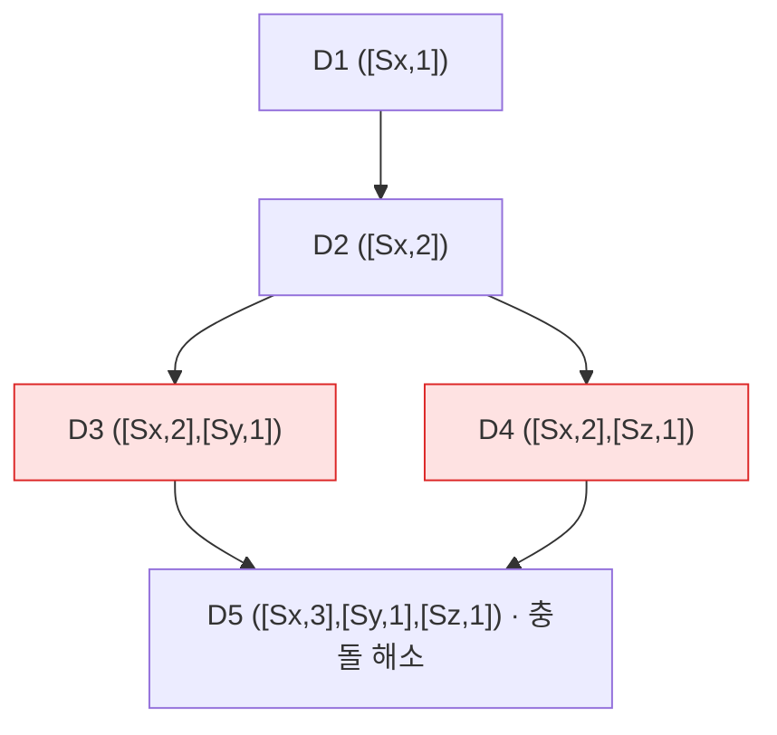

- 정족수가 안 설 때:
  - 노드가 여러 대 죽으면 느슨한 정족수(sloppy quorum)로 간다.
  - 장애 서버는 건너뛰고 해시 링에서 건강한 W개·R개를 고른다.

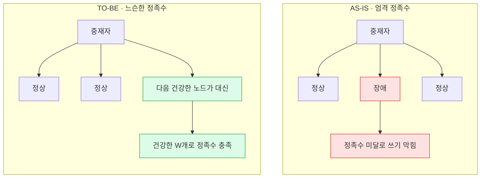

- 요약 비교를 어떻게 좁히나:
  - 그게 머클 트리다.
  - 루트 해시부터 비교해 다른 버킷만 자식으로 내려가며 찾는다.
  - 동기화 양이 데이터 총량이 아니라 차이 크기에만 비례한다.

루트가 같으면 끝, 다르면 다른 쪽 자식만 따라 내려가 차이 난 버킷에 도달한다.

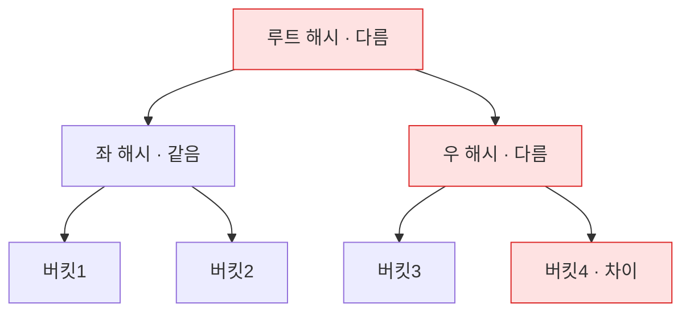

### 틀을 못 세웠던 것

결론은 냈지만 그 결론이 어느 분류에 서는지를 못 박았던 자리다.

- CAP:
  - 1주차는 "가용성 우선" 결론만 냈다.
  - 책은 CP/AP/CA로 나누고, 우리 설계가 AP임을 분명히 한다.
  - 파티션은 피할 수 없어 CA는 현실에 없다는 점도 1주차는 놓쳤다.

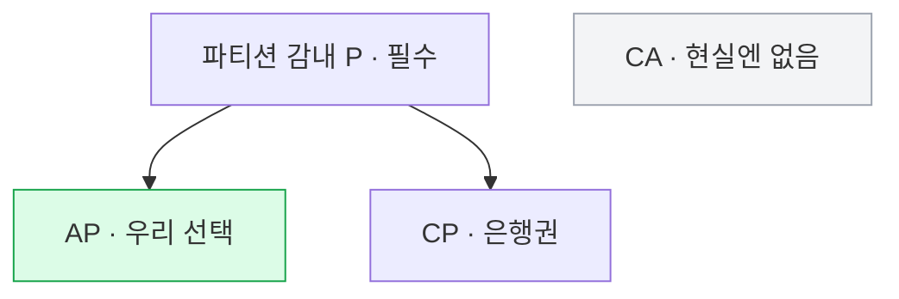

- 일관성 모델:
  - 1주차는 "잠깐 옛 값이 보일 수 있다"고만 했다.
  - 책 용어로는 최종 일관성이고, 강한·약한·최종 중 한 점이다.
- 중재자:
  - 1주차는 "요청 받은 노드"로만 처리했다.
  - 책은 이를 중재자(coordinator), 클라이언트와 노드 사이의 프락시로 정의한다.
- 데이터 센터:
  - 1주차 복제는 "다른 물리 서버"까지만 갔다.
  - 책은 센터가 통째로 죽는 경우까지 보고 사본을 여러 센터에 둔다.

## 2. 책에서 새로 알게 된 핵심: 빈칸 채우기

1주차에 이름 없이 도출한 개념과 책의 정식 명칭을 맞춰봤다. 여섯 개 모두 대응되는 기법이 있었다.

| 1주차에서 도출한 개념 | 책의 정식 명칭 |
|---|---|
| 4번 원형 번호판 배치 | 안정 해시(Consistent Hash) + 가상 노드 |
| 6번 다수결 `W+R>N` | 정족수 합의(Quorum Consensus) |
| 7번 인과관계 추적 | 벡터 시계(Vector Clock) |
| 8번 소문 퍼뜨리기 | 가십 프로토콜(Gossip Protocol) |
| 9번 임시 대리수신 / 요약 비교 | 단서 후 임시 위탁(Hinted Handoff) / 안티 엔트로피 + 머클 트리 |
| 10번 요약 필터 / 디스크 로그 / 파일 구조 | 블룸 필터 / 커밋 로그 / SSTable |

핵심 기법의 동작과 한계만 짧게 박아둔다.

- 벡터 시계:
  - 서버별 버전 카운터를 매달아 선후·충돌을 가린다.
  - 단점은 둘이다. 충돌 해소 로직이 클라이언트로 들어가 복잡해지고, 순서쌍이 빨리 늘어 잘라내야 한다.
- 정족수:
  - `W=1`은 한 서버에만 쓴다는 뜻이 아니라, 중재자가 한 서버의 성공 응답만 기다린다는 뜻이다.
  - W·R을 키우면 일관성이 오르고 응답은 느려진다.
- 장애 처리:
  - 일시 장애는 단서 후 임시 위탁 + 느슨한 정족수로 받는다.
  - 영구 장애는 안티 엔트로피 + 머클 트리로 복제본을 맞춘다.

노드 안에서 쓰기와 읽기가 흐르는 경로다.

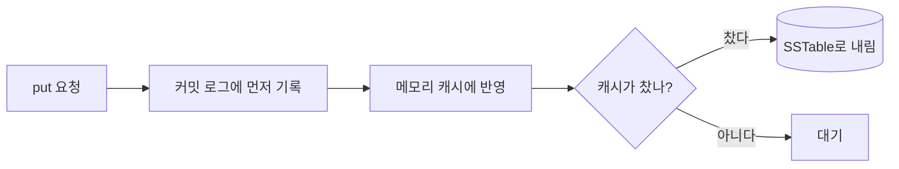

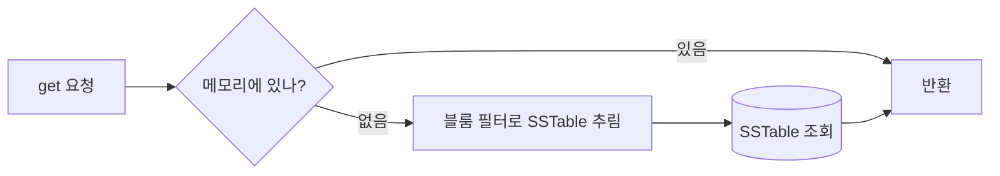

## 3. 책 설계와 내 설계가 갈린 지점

기법 단위에서 크게 어긋난 곳은 적었다. 갈린 건 기법보다 윗단, 설계를 설명하는 틀이었다.

- 책이 나았던 곳:
  - CAP을 CP/AP/CA로 나눠 우리 선택의 위치를 못 박았다.
  - 일관성을 강한·약한·최종으로 모델링했다.
  - 중재자를 프락시로 정의하고, 데이터 센터 장애까지 시야에 넣었다.
- 1주차가 그래도 또렷했던 곳:
  - 책은 기법을 병렬로 나열한다.
  - 1주차는 "0번 요구가 이 결정을 강제한다"는 인과로 결정을 엮어, 왜 이 기법인지를 설명하기엔 더 나았다고 본다.

## 4. 카프카와의 대조: 합의와 복제는 본질이 어떻게 다른가

카프카를 앵커로 보면 이 키-값 저장소가 무엇을 뺀 설계인지 또렷해진다. 갈림의 뿌리는 하나다. 카프카는 리더가 있고(primary-backup), 다이나모형 키-값은 리더가 없다(leaderless).

카프카는 쓰기가 리더를 지나며 순서가 하나로 정해진다. 합의(KRaft)는 메타데이터용 별도 레이어다.

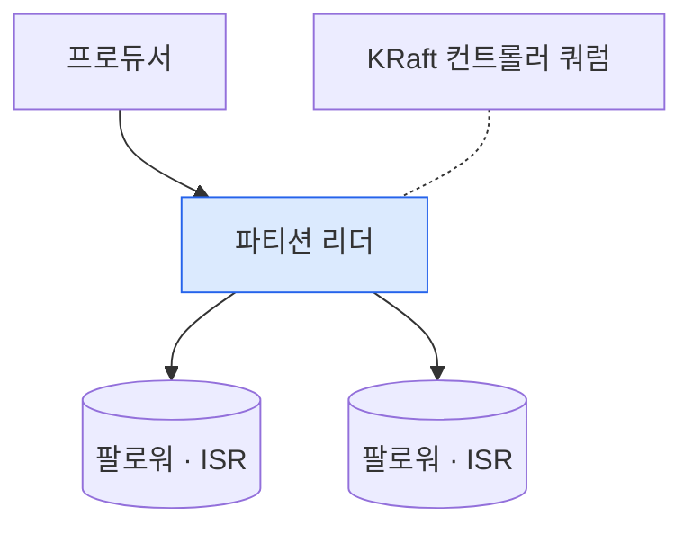

키-값은 리더가 없어 아무 노드나 중재자가 되고, 순서를 정하지 않는다. 충돌은 사후에 벡터 시계로 푼다.

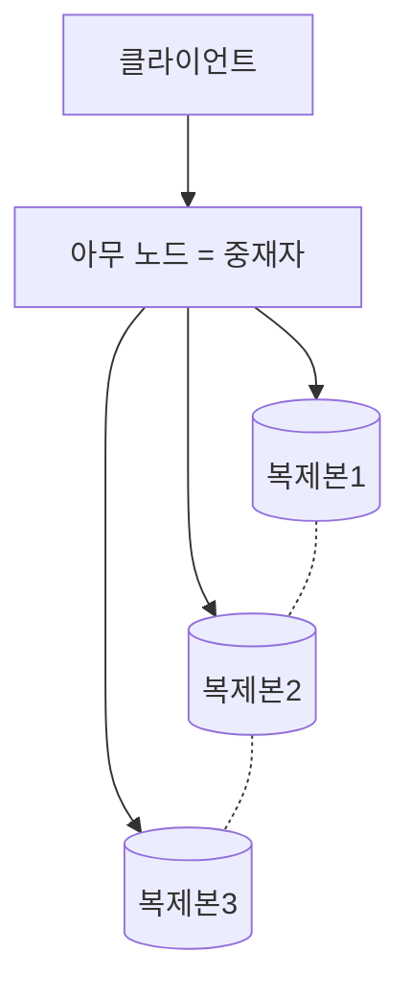

본질 차이는 세 줄로 정리된다.

- 리더 유무:
  - 카프카는 모든 쓰기가 리더를 지나 순서가 하나로 정해진다.
  - 키-값은 리더가 없어 아무 중재자나 받고 순서를 매기지 않는다.
- 합의와 정족수의 차이:
  - 카프카 KRaft는 진짜 합의(Raft)라 단일한 진실을 만든다.
  - 키-값 `W+R>N`은 합의가 아니라, 겹치는 노드가 최신값을 본다는 보장일 뿐이다.
  - 그래서 동시 쓰기를 막지 못하고 벡터 시계로 사후에 푼다.
- "잠깐 빠졌다 복귀"의 처리:
  - 카프카는 ISR에서 빠진 동안 그 복제본에 쓰지 않는다. 리더가 ISR만 세기 때문이다.
  - 키-값은 빠진 동안에도 단서 후 임시 위탁으로 대리 노드가 받아둔다.
  - 가용성을 우선해 빠진 노드 몫까지 일단 받는 쪽이다.

표로 보면 이렇다.

| 항목 | 카프카 | 다이나모형 키-값 |
|---|---|---|
| 쓰기 경로 | 파티션 리더 경유 | 아무 노드(중재자) |
| 순서 | 리더가 독점해 하나로 | 정하지 않음 |
| "합의" | KRaft(Raft) 강합의, 정적 voter | 정족수 `W+R>N`, 합의 아님 |
| 복제 집합 | 배치는 고정, ISR 멤버십은 동적 | 해시 링이 결정, 노드 증감 시 재배치 |
| 충돌 | 리더 순서로 발생하지 않음 | 동시 쓰기 허용 후 벡터 시계로 해소 |
| 빠졌다 복귀 | ISR shrink/expand | 단서 후 임시 위탁 + 머클 트리 |

## 5. 보완한 최종 아키텍처

모든 노드가 같은 역할을 한다. 마스터가 없고, 요청을 받은 노드가 중재자가 되어 클라이언트의 프락시로 동작한다. 1주차 구조에 정식 명칭을 입히면 이렇게 정리된다.

| 목표 | 기법 |
|---|---|
| 대규모 데이터 분산 | 안정 해시 + 가상 노드 |
| 읽기·쓰기 고가용 | 여러 데이터 센터 노드에 다중화 |
| 조절 가능한 일관성 | 정족수 합의 `W+R>N` |
| 동시 쓰기 충돌 해소 | 버저닝 + 벡터 시계 |
| 장애 감지 | 가십 프로토콜 |
| 일시 장애 | 느슨한 정족수 + 단서 후 임시 위탁 |
| 영구 장애 | 안티 엔트로피 + 머클 트리 |
| 노드 내부 저장 | 커밋 로그 + 메모리 캐시 + SSTable + 블룸 필터 |

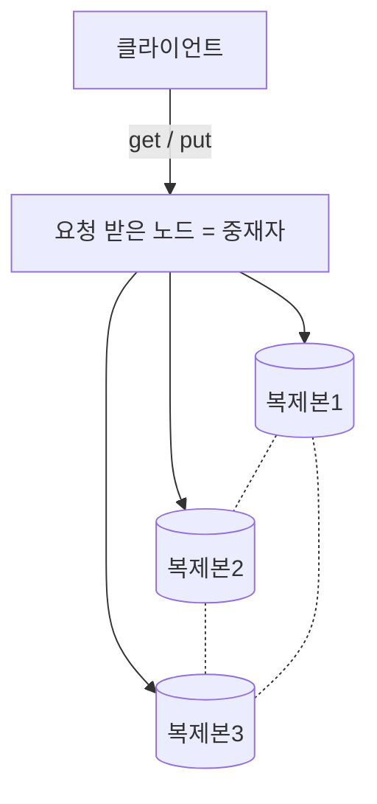

세 복제본은 가십 프로토콜로 서로의 생사를 주고받는다(점선).

- 쓰기 경로: 커밋 로그에 먼저 적고 메모리 캐시에 반영한 뒤, 캐시가 차면 SSTable로 내린다.
- 읽기 경로: 메모리를 먼저 보고, 없으면 블룸 필터로 SSTable을 추려 디스크에서 가져온다.

## 6. 다음에 가져갈 교훈

- 이름보다 필요가 먼저다:
  - 여섯 빈칸을 이름 없이 맞춰본 건, 요구에서 필요를 끌어내는 순서로 설계한 덕으로 보인다.
  - 다음 챕터도 정답 용어부터 찾지 않고 요구에서 내려가는 방식을 유지한다.
- 틀을 먼저 세우자:
  - 1주차가 아쉬웠던 건 기법이 아니라 그 위의 틀(CAP, 일관성 모델, 중재자 정의)이었다.
  - 결론만 내리지 말고 그 결론이 어느 분류에 서는지를 먼저 박는다.

### 심화: 책의 한계와 우리 서비스

- 최종 일관성의 비용:
  - AP·최종 일관성은 충돌 해소를 클라이언트로 떠민다.
  - 벡터 시계를 쓰면 클라이언트가 복잡해지고, 순서쌍을 자르면 선후가 부정확해진다.
  - 단순함을 원하면 LWW(마지막 쓰기 우선)로 갈 수 있지만, 시계가 어긋나면 쓰기 하나를 조용히 잃는다.
- 우리 서비스라면:
  - 읽기 9:1에 값이 수 KB라는 가정에선 읽기를 빠르게, 충돌은 드물게 가는 쪽이 맞다.
  - `N=3, W=2, R=2`를 기본으로 두되, 옛 값을 잠깐 봐도 되는 데이터는 `R=1`로 읽기를 더 싸게 내릴 수 있다.
  - 충돌이 드물면 벡터 시계 대신 LWW로 단순화하는 것도 선택지다.
